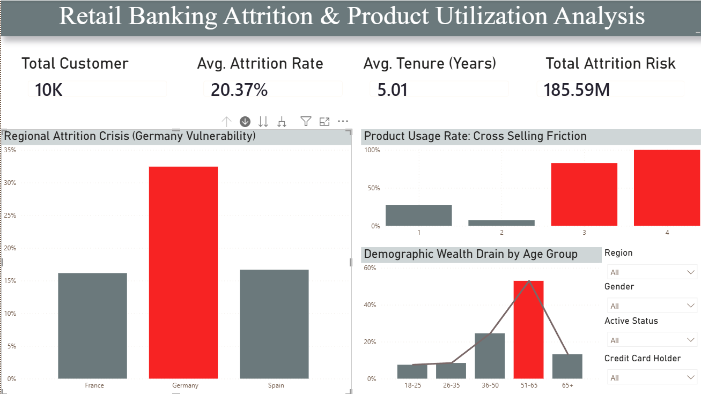

# Retail Banking Attrition & Product Utilization Analysis

## 📌 Project Overview
Architected an end-to-end analytics pipeline for 10,000+ customer records to diagnose localized retention failures and product-market friction. 

 

## 🛠️ Tech Stack
* **Exploratory Data Analysis:** Python (Pandas, Matplotlib)
* **Relational Modeling:** MySQL (Star Schema configuration)
* **Visualization & Analytics:** Power BI, DAX

## 🚀 Key Business Insights
* **Regional Vulnerability:** Diagnosed a 37.5% localized churn rate in the German market, nearly double the baseline of adjacent European regions.
* **Cross-Selling Catastrophe:** Exposed an 82–100% attrition risk tied to cross-selling friction, proving that customers holding 3 or more bank products are highly likely to abandon the bank.
* **Demographic Wealth Drain:** Tracked high-risk attrition among older, higher-net-worth demographics, identifying a critical threat to long-term portfolio stability.

## 📂 Repository Structure
* `EDA_Banking_Attrition.ipynb`: Python code for initial data profiling and cleaning.
* `Data_Modeling.sql`: Database queries used to structure the analytical tables.
* `Executive_Dashboard.png`: Final Power BI report highlighting KPIs and business failures.
